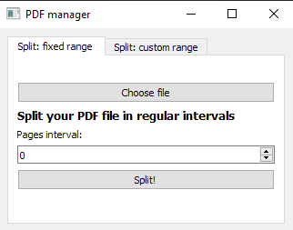
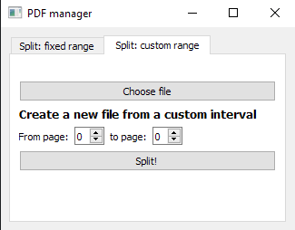

## Splitting PDFs with Python
This is a small study project for me to understand a bit of OOP concepts using PyQt and PyPDF.
If you want to run it, clone this repository, install the dependencies from `requirements.txt` and run `main.py` 

You will have two options to split your file:
- In regular intervals

- In a custom range of pages

Then, the created file(s) will be saved on your current directory :)